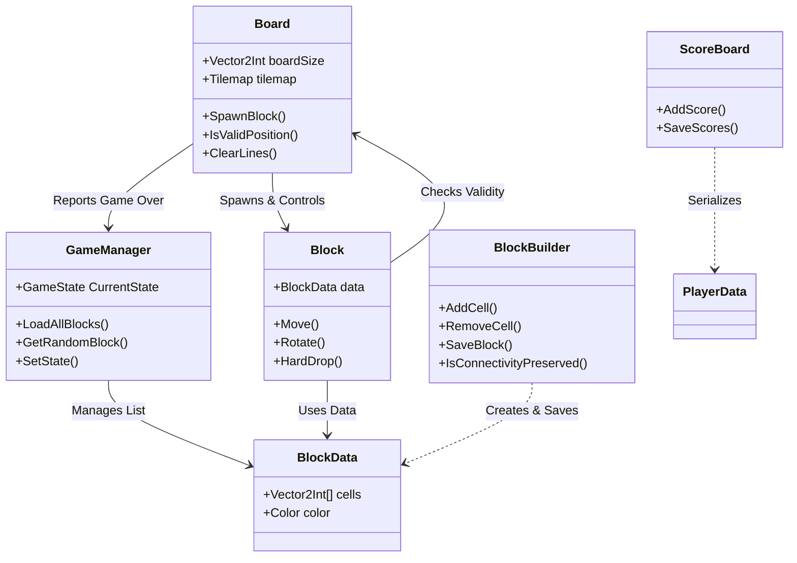
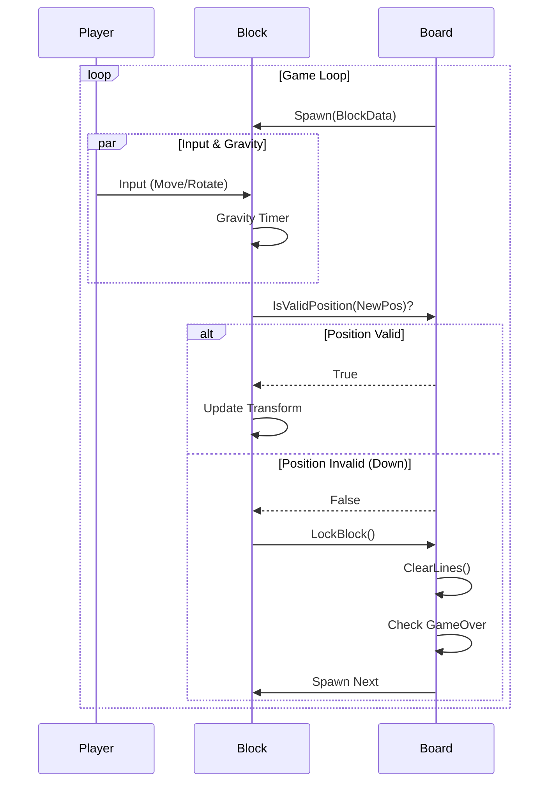

# Tetris Project Architecture Documentation

This document provides a comprehensive technical overview of the Tetris Unity project. It is designed to help new developers understand the codebase, data flow, and architecture quickly.

## 1. High-Level Architecture

The project follows a component-based architecture typical of Unity, centered around a few core managers and independent systems for gameplay and content creation.

### Core Systems
*   **Game Loop**: Controlled by `GameManager` (State) and `Board` (Logic).
*   **Data**: `BlockData` (ScriptableObject) serves as the schema for both built-in (Resources) and custom (PlayerPrefs) blocks.
*   **Building**: A standalone system (`BlockBuilder`) allows players to create valid, connected block shapes.

---

## 2. Core Systems Detail

### 2.1 Game Manager (`GameManager.cs`)
**Role**: The central Singleton controller used to manage application state and block loading.
**Persistence**: `DontDestroyOnLoad` ensures it persists across scenes.

*   **State Management**: Uses the `GameState` enum (Menu, Playing, Paused, GameOver, Building).
*   **Block Registry**:
    *   **Built-in Blocks**: Loaded from `Assets/Resources/Blocks` via `Resources.LoadAll`.
    *   **Custom Blocks**: Loaded from `PlayerPrefs`. The key `BLOCK_REGISTRY` contains a semicolon-separated list of custom block names. Each name points to a JSON string stored in `CustomBlock_{name}`.

### 2.2 The Board (`Board.cs`)
**Role**: The "Brain" of the gameplay. It manages the grid, spawning, scoring, and rules.

*   **Grid System**:
    *   Uses Unity's `Tilemap` system.
    *   `backgroundTilemap`: Renders the static grid background.
    *   `tilemap`: Renders the locked blocks (the "heap").
*   **Spawning Logic**:
    *   Maintains a queue of `NextBlockCount` (3) blocks.
    *   Instantiates a `Block` prefab and initializes it with `BlockData`.
    *   **Centering**: dynamically calculates the spawn X offset based on the block's width to ensure it spawns perfectly centered.
*   **Validation**: `IsValidPosition` checks if a block's cells are within bounds and not overlapping existing tiles.
*   **Line Clearing**: Checks rows from bottom to top. If a row is full (`IsLineFull`), it clears the tiles and shifts all tiles above it down 1 unit.

### 2.3 The Block (`Block.cs`)
**Role**: Represents the temporary, active falling piece.

*   **Initialization**: dynamically generates child GameObjects with `SpriteRenderer` components for each cell in `BlockData.cells`.
*   **Movement**:
    *   **Gravity**: Automatically moves down every `stepTime` seconds.
    *   **Input**: Listens to Input System actions (Move vector) and direct keys (Space for Hard Drop).
*   **Rotation**:
    *   Rotates 90 degrees on the Z-axis.
    *   **Wall Kicks**: If a rotation lands in an invalid spot (e.g., inside a wall), it attempts to "kick" the block 1 unit Left, Right, or Up. If all fail, the rotation is reverted.
*   **Locking**: When a downward move fails, it calls `Board.LockBlock()`, which transfers the block's visual sprites onto the `Tilemap` and destroys the `Block` GameObject.

#### Gameplay Flow

---

## 3. Building System (`BlockBuilder.cs`)

Allows players to design custom blocks. It enforces rules to ensure blocks are playable.

*   **Data Structure**: uses a `HashSet<Vector2Int>` to track active cells (pixels).
*   **Constraints**:
    *   **Anchor Point**: The cell at `(0,0)` acts as the anchor and cannot be removed effectively (or is re-verified).
    *   **Max Blocks**: Limits the number of cells (defined by `MAX_BLOCKS`).
    *   **Connectivity**: A generic Flood Fill algorithm (`IsConnectivityPreserved`) runs before any pixel removal to ensure the block doesn't split into two separate islands.

### Saving & Loading
*   **Architecture**:
    *   `BlockData` instance is created from the active cells.
    *   Converted to JSON using `JsonUtility`.
    *   Saved to `PlayerPrefs` under `CustomBlock_{Name}`.
    *   Name is added to the `BLOCK_REGISTRY` list in PlayerPrefs.

---

## 4. Data & Persistence

### 4.1 Block Data
**Script**: `BlockData.cs`
**Type**: `ScriptableObject`
**Fields**:
*   `Vector2Int[] cells`: Array of relative coordinates (e.g., `(0,0)`, `(0,1)`).
*   `Color color`: Tint color for the block.

### 4.2 Score System
**Script**: `ScoreBoard.cs` & `PlayerData.cs`
**Type**: JSON File Persistence
**Location**: `Application.persistentDataPath + "/highscores.json"`

*   Unlike blocks, scores are saved to a physical JSON file, not PlayerPrefs.
*   `ScoreBoard` is a Singleton that loads scores on Awake and saves on every update.

---

## 5. Script Reference

| Script | Location | Key Responsibility |
| :--- | :--- | :--- |
| **GameManager** | `Core/` | App state, block loading, scene transitions. |
| **Board** | `Core/` | Grid management, line clearing, game rules. |
| **Block** | `Core/` | Active piece logic, input handling, wall kicks. |
| **InputSystem_Actions** | `Assets/` | Auto-generated class from Unity's Input System. |
| **BlockBuilder** | `Building/` | Logic for editing custom shapes. |
| **SavedBlockItem** | `Building/` | UI component for block list items (handles previews). |
| **ScoreBoard** | `Core/` | High score management (Save/Load). |
| **Verification** | `Core/` | (Unused/Auxiliary) Likely for future server-side validation. |

## 6. How to Add New Features

### Adding a New Built-in Block
1. Create a new `BlockData` asset in `Assets/Resources/Blocks/`.
2. Configure the `Cells` array in the inspector.
3. The `GameManager` will automatically pick it up due to `Resources.LoadAll`.

### Modifying Game Speed
*   In `Block.cs`, modify the `stepTime` variable. To implement difficulty scaling, expose this variable to `GameManager` or `Board` and decrease it as `Board.score` increases.

### Customizing Controls
*   Edit the `InputSystem_Actions.inputactions` asset in the root `Assets` folder to change bindings. The `Block` script simply listens to the `Move` action defined there.
