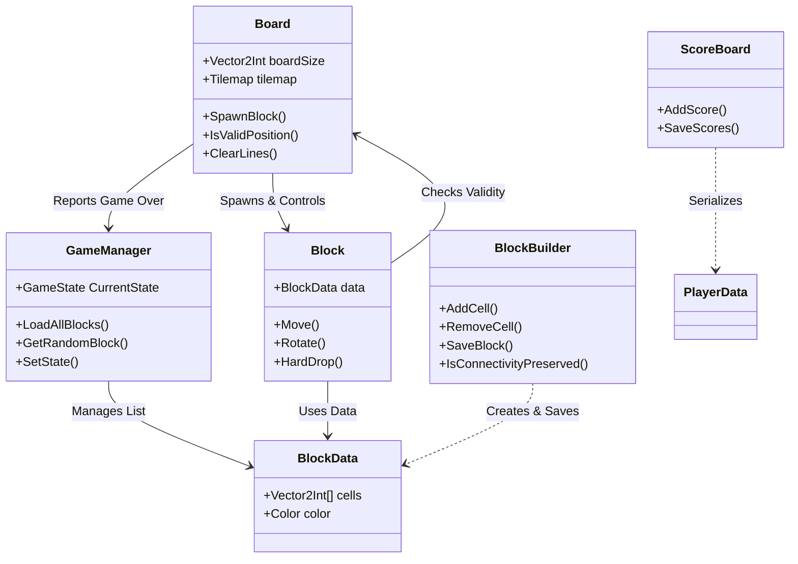
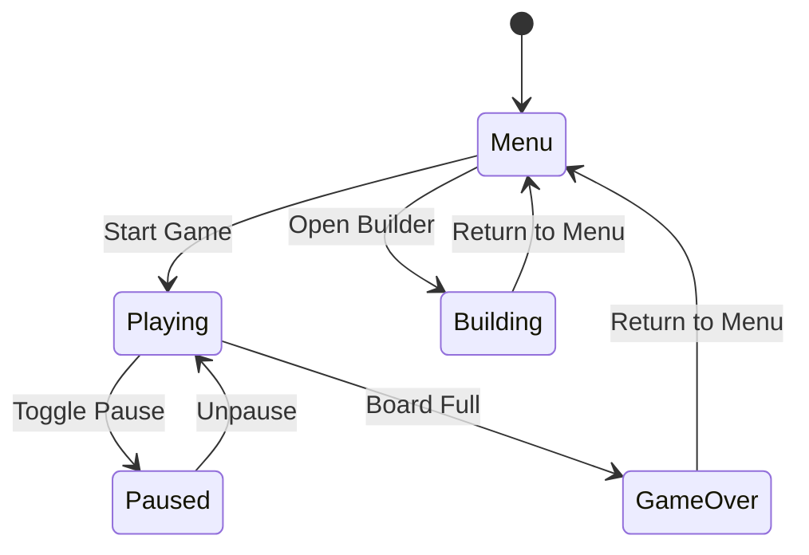
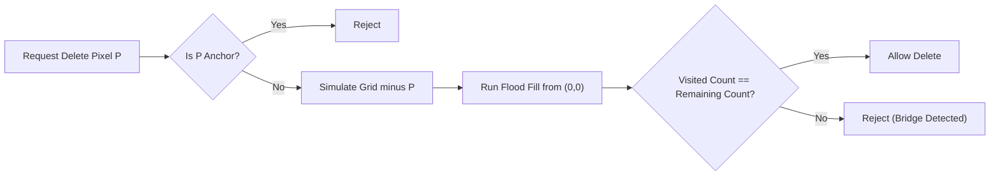

# Tetris Project Architecture Documentation

This document provides a comprehensive technical overview of the Tetris Unity project. It is designed to help new developers understand the codebase, data flow, and architecture quickly.

## 1. High-Level Architecture

The project follows a component-based architecture typical of Unity, centered around a few core managers and independent systems for gameplay and content creation.

### Core Systems
*   **Game Loop**: Controlled by `GameManager` (State) and `Board` (Logic).
*   **Data**: `BlockData` (ScriptableObject) serves as the schema for both built-in (Resources) and custom (PlayerPrefs) blocks.
*   **Building**: A standalone system (`BlockBuilder`) allows players to create valid, connected block shapes.

---

## 2. State & Flow Management

### 2.1 Pattern: Centralized Finite State Machine (FSM)
The game does **not** use a Stack-Based State Machine (push/pop). Instead, it uses a simpler **Centralized Finite State Machine** managed by the `GameManager` Singleton.

**Why this pattern?**
Tetris has a linear, mutually exclusive flow. You are either in the Menu, Playing, or Game Over. You rarely need to "return" to a previous state in a way that requires a history stack (unlike an RPG with nested menus).

### 2.2 Implementation Details
*   **State Enums**: Defined in `GameManager.GameState` (`Menu`, `Playing`, `Paused`, `GameOver`, `Building`).
*   **State Logic (`SetState`)**:
    *   **Playing**: Sets `Time.timeScale = 1`. Physics and Coroutines run normally.
    *   **Paused**: Sets `Time.timeScale = 0`. This effectively freezes the `Block`'s gravity timer without needing extra "isPaused" booleans in every script.
    *   **Menu/GameOver**: Purely logical states that trigger UI overlays.

### 2.3 State Persistence & Destructiveness
It is critical to understand which transitions clear the game state:

*   **Non-Destructive (Overlay)**:
    *   **Playing <-> Paused**: Toggling pause simply freezes time. The board, score, and active block remain exactly as they are. The `Board` GameObject is **not** destroyed.
    *   **Playing -> Game Over**: The state flag changes, showing the Game Over UI, but the final state of the board remains visible in the background.

*   **Destructive (Reset)**:
    *   **Game Over -> Menu**: This calls `SceneManager.LoadScene("MainMenu")`. The entire `GameScene` (Board, Spawner, Block) is unloaded from memory.
    *   **Menu -> Playing**: Logic enters `GameScene`. A fresh `Board` and `Grid` are instantiated.
    *   **Restart**: Reloads `GameScene`, effectively wiping the board clean.

---

## 3. Core Systems Detail

### 3.1 Game Manager (`GameManager.cs`)
**Role**: The persistent application controller.
*   **Persistence**: `DontDestroyOnLoad` is used. Logic ensures only one instance exists.
*   **Block Registry**:
    *   **Built-in Blocks**: Loaded from `Assets/Resources/Blocks` via `Resources.LoadAll`.
    *   **Custom Blocks**: Loaded from `PlayerPrefs`. The key `BLOCK_REGISTRY` contains a semicolon-separated list of custom block names. Each name points to a JSON string stored in `Key: CustomBlock_{name}`.

### 3.2 The Board (`Board.cs`)
**Role**: The "Brain" of the gameplay. It manages the grid, spawning, scoring, and rules.
**Coordinate System**:
*   **Grid Space**: `Vector2Int` (x, y) integers.
*   **World Space**: `Vector3` (x, y, z).
*   **Mapping**: 1 Unit = 1 Cell. The Board uses `Vector3Int.RoundToInt()` to snap the floating point positions of falling blocks into strict grid coordinates.

*   **Logic**:
    *   **Spawning**: Maintains a queue of `NextBlockCount` (3) blocks.
    *   **Centering**: Dynamically calculates spawn offsets. It looks at the `minX` and `maxX` of the block's cells and centers the shape relative to `boardSize.x / 2`.
    *   **Validation**: `IsValidPosition` performs a bounds check AND a tile collision check against the `Tilemap`.

### 3.3 The Block (`Block.cs`)
**Role**: Represents the temporary, active falling piece.
**Input Architecture**: **Hybrid (Event + Polling)**.
*   **Events**: Uses Unity's Input System `actions.Player.Move` event for directional movement. This ensures responsive handling of button presses.
*   **Polling**: Uses `Keyboard.current.wasPressedThisFrame` inside `Update()` for actions like Hard Drop (Space) and Hold (Shift).
    *   *Note: This hybrid approach was chosen for simplicity, but strictly speaking, all input should ideally be moved to the modular Event system for full controller support.*

*   **Key Mechanics**:
    *   **Gravity**: A `stepTimer` accumulates `Time.deltaTime`. When it exceeds `stepTime`, the block moves down.
    *   **Wall Kicks**: A naive wall kick system is implemented. If a rotation fails, it attempts to offset the block by `+1 X`, `-1 X`, or `+1 Y`. If any of these target positions are valid, the kick succeeds.

---

## 4. Building System & Algorithms

The `BlockBuilder.cs` allows players to design custom blocks. This requires a specific algorithm to prevent invalid shapes (e.g., two disconnected islands of pixels).

### 4.1 Connectivity Algorithm (Flood Fill)
Because a block must be a single cohesive unit, we cannot allow players to delete a pixel if it bridges two other sections.

**The Check (`IsConnectivityPreserved`)**:
When a player tries to remove a pixel P:
1.  **Simulation**: We temporarily simulate the grid *without* P.
2.  **Breadth-First Search (BFS)**:
    *   Start from the Anchor (0,0) - which is always present.
    *   Traverse to all adjacent neighbors that exist in the simulated grid.
    *   Count the number of visited nodes.
3.  **Validation**: If `Visited Count == Total Remaining Pixels`, the shape is still one piece. If not, P was a bridge, and the deletion is rejected.

---

## 8. Automation & Editor Tools

The project includes a powerful Editor script to bootstrap the entire environment. This allows new developers (or the automated build system) to regenerate all Scenes, Prefabs, and Assets from scratch without keeping binary files in the repo.

### 8.1 Auto-Setup Tool
**Location**: `Tetris > Setup Project` (Top Menu Bar)
**Script**: `Assets/Scripts/Editor/ProjectSetupTools.cs`

**Functionality**:
1.  **Directory Check**: Ensures `Assets/Scenes`, `Resources/Blocks`, and `Prefabs/UI` exist.
2.  **Asset Generation**:
    *   **Blocks**: Programmatically creates 7 standard `BlockData` assets (I, J, L, O, S, T, Z) with correct colors and cell shapes.
    *   **Textures**: Generates a 32x32 pixel `Square.png` sprite on the fly.
    *   **Prefabs**: Constructs UI Prefabs (`CellPrefab`, `SavedItemPrefab`) code-side to ensure UI consistency.
3.  **Scene Construction**:
    *   Creates/Overwrites 4 Scenes: `MainMenu`, `GameScene`, `OptionsScene`, `BuildingScene`.
    *   dependency injection: It automatically places Managers, Canvases, and links UI buttons to their scripts (e.g., `MainMenuUI`, `GameHUD`).

> [!TIP]
> Use this tool if your scenes look broken or if you are setting up the project on a fresh machine. It is designed to be idempotent (safe to run multiple times).

---

## 5. Data & Persistence Patterns

### 5.1 ScriptableObjects (`BlockData`)
**Why?**
ScriptableObjects are used for block definitions because they are essentially shared, static data.
*   **Memory Efficient**: All instances of a "T-Block" reference the same `BlockData` object in memory, rather than copying arrays of cells.
*   **Inspector Friendly**: Easy to edit in the Editor.

### 5.2 PlayerPrefs (Custom Blocks)
**Why?**
*   **Simplicity**: Custom blocks are small JSON strings. Setting up a full SQLite or file system database would be over-engineering for 5-6 arrays of integers.
*   **Key-Value**: We map `CustomBlock_{Name}` -> `JSON`.

### 5.3 JSON Files (Heavier Data)
**Why?**
*   `ScoreBoard` saves to `Application.persistentDataPath/highscores.json`.
*   We use a dedicated JSON file here instead of PlayerPrefs because it is structured data (List of objects) that might grow, and it separates user progress from simple settings.

---

## 6. Script Reference

| Script | Locations | Key Responsibility |
| :--- | :--- | :--- |
| **GameManager** | `Core/` | App State Machine (FSM), Asset Loading. |
| **Board** | `Core/` | Grid Logic, Tilemap Interface, Line Clearing. |
| **Block** | `Core/` | Active Piece Physics, Input Listening (Hybrid). |
| **InputSystem_Actions** | `Assets/` | Auto-generated Input Wrapper. |
| **BlockBuilder** | `Building/` | Custom Shape Editor, Connectivity Algorithms. |
| **SavedBlockItem** | `Building/` | UI View for Block List (Procedural Preview Generation). |
| **ScoreBoard** | `Core/` | High Score Persistence (File IO). |

## 7. How to Add New Features

### Adding a New Built-in Block
1. Create a new `BlockData` asset in `Assets/Resources/Blocks/`.
2. Configure the `Cells` array in the inspector.
3. The `GameManager` will automatically pick it up due to `Resources.LoadAll`.

### Modifying Game Speed
*   In `Block.cs`, modify the `stepTime` variable. To implement difficulty scaling, expose this variable to `GameManager` or `Board` and decrease it as `Board.score` increases.

### Customizing Controls
*   Edit the `InputSystem_Actions.inputactions` asset in the root `Assets` folder to change bindings. The `Block` script simply listens to the `Move` action defined there.
